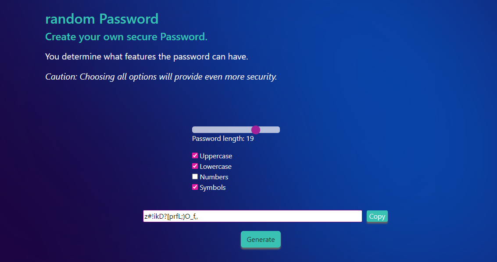

 🗝 PASSWORD GENERATOR

 [https://passwordrandomizer.vercel.app/](https://passwordrandomizer.vercel.app/)

 
This is a simple password generator web application that allows users to create a password with a custom length and set of characters.

<h2>**Features**</h2>
Users can choose the length of the password, with a minimum of 4 characters and a maximum of 24 characters.
Users can select which types of characters to include in the password, including uppercase letters, lowercase letters, symbols, and numbers.
Getting Started
To use the password generator, simply visit the website and follow these steps:

Choose the desired length of the password by entering a number between 4 and 24 in the input field labeled "Password Length".
Check the checkboxes labeled with the types of characters you want to include in the password. You can choose any combination of uppercase letters, lowercase letters, symbols, and numbers.
Click the "Generate Password" button to generate a password with the selected options.
Your password will be displayed in the text area labeled "Generated Password". You can copy it to your clipboard by clicking the "Copy to Clipboard" button.
Technologies Used
The password generator was built using the following technologies:

HTML5
CSS3
JavaScript
Tailwind CSS
License
This project is licensed under the MIT License - see the LICENSE.md file for details.

⚡️EXAMPLE

Acknowledgments
This project was inspired by various other password generator tools available online. Special thanks to the creators of these tools for providing inspiration and guidance.

